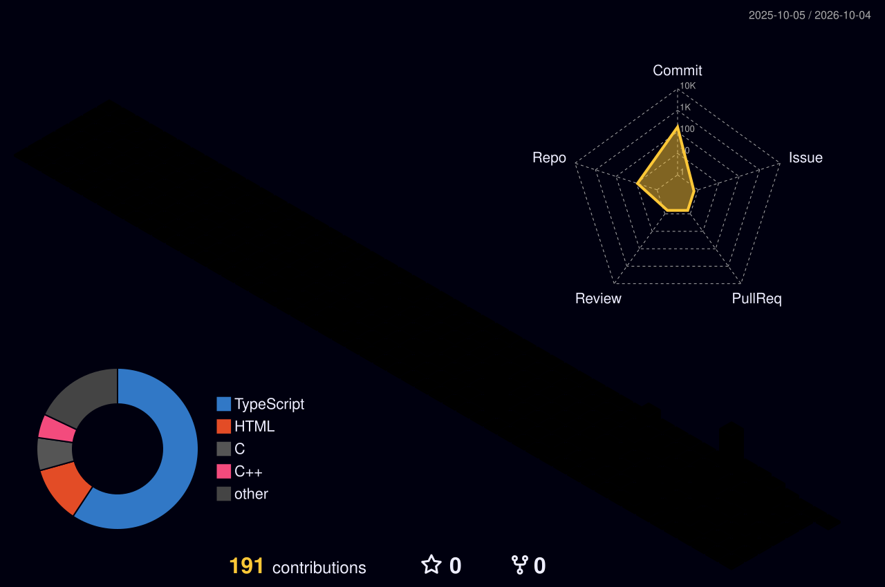

  

<h1 align="center">Hi 👋, I'm Anuj Purbe</h1>

<h3 align="center">Computer Engineering Student</h3>

  

## 🚀 Tech Stack

### 💻 Languages

  

### 🌐 Web Development

  

### 🛠️ Tools & Platforms

  

## 📊 GitHub Analytics

  
  

## GitHub Streak

## 📈 Anuj's GitHub Contribution Graph

  

## 🚀 Featured Projects

### 🍔 FoodieHub
Modern food ordering website with responsive design and interactive UI.

### 🔋 Atomic Battery Endurance Analysis
Research-oriented platform for analyzing atomic battery lifespan, endurance, and energy density characteristics.

### 💻 DSA Practice Repository
Collection of Data Structures and Algorithms solutions.

## 🌐 Connect With Me

## 📊 3D Contribution Calendar

  

